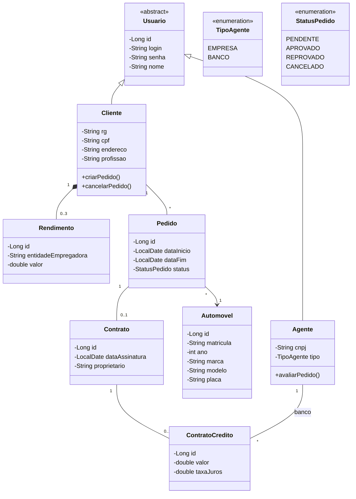

# Diagrama de Classes - v1

Primeira versão, feita a partir do enunciado.

```mermaid
classDiagram
    class Usuario {
        <<abstract>>
        -Long id
        -String login
        -String senha
        -String nome
    }

    class Cliente {
        -String rg
        -String cpf
        -String endereco
        -String profissao
        +criarPedido()
        +cancelarPedido()
    }

    class Rendimento {
        -Long id
        -String entidadeEmpregadora
        -double valor
    }

    class Agente {
        -String cnpj
        -TipoAgente tipo
        +avaliarPedido()
    }

    class TipoAgente {
        <<enumeration>>
        EMPRESA
        BANCO
    }

    class Automovel {
        -Long id
        -String matricula
        -int ano
        -String marca
        -String modelo
        -String placa
    }

    class Pedido {
        -Long id
        -LocalDate dataInicio
        -LocalDate dataFim
        -StatusPedido status
    }

    class StatusPedido {
        <<enumeration>>
        PENDENTE
        APROVADO
        REPROVADO
        CANCELADO
    }

    class Contrato {
        -Long id
        -LocalDate dataAssinatura
        -String proprietario
    }

    class ContratoCredito {
        -Long id
        -double valor
        -double taxaJuros
    }

    Usuario <|-- Cliente
    Usuario <|-- Agente
    Cliente "1" *-- "0..3" Rendimento
    Cliente "1" -- "*" Pedido
    Pedido "*" --> "1" Automovel
    Pedido "1" -- "0..1" Contrato
    Contrato "1" -- "0..1" ContratoCredito
    Agente "1" -- "*" ContratoCredito : banco
```
